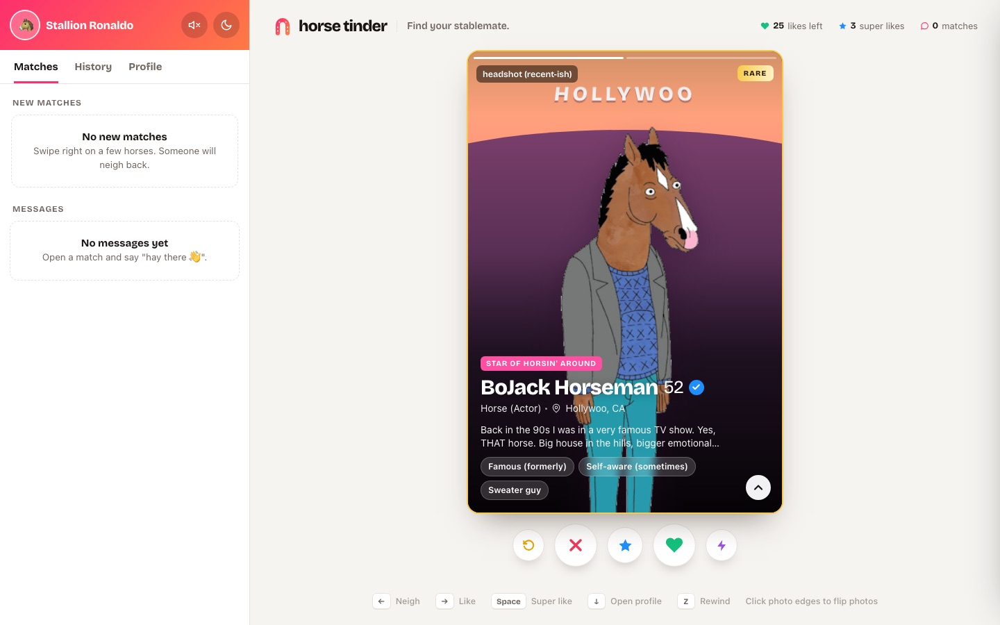
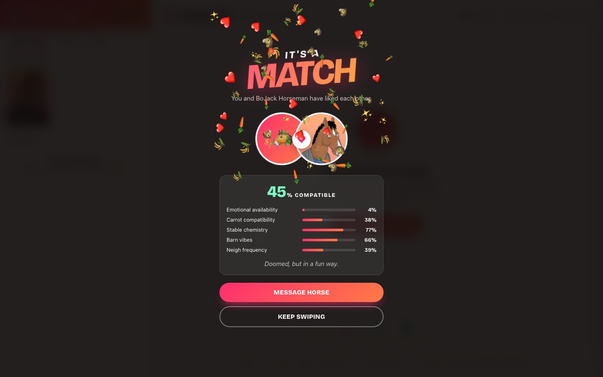
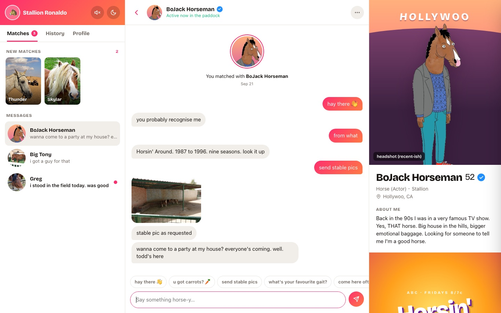
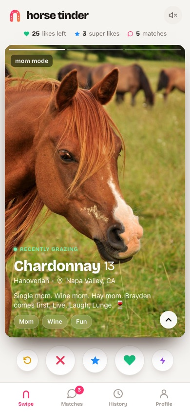
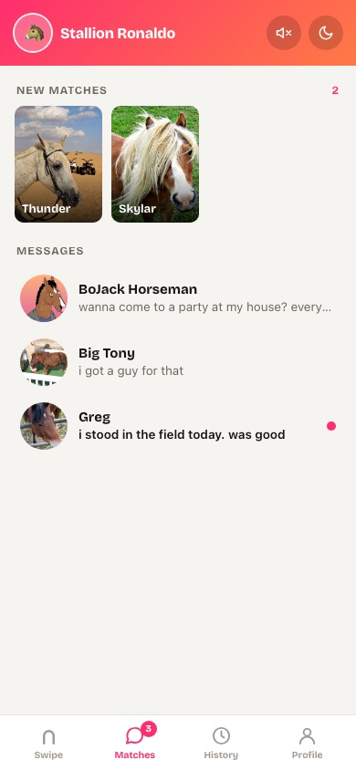
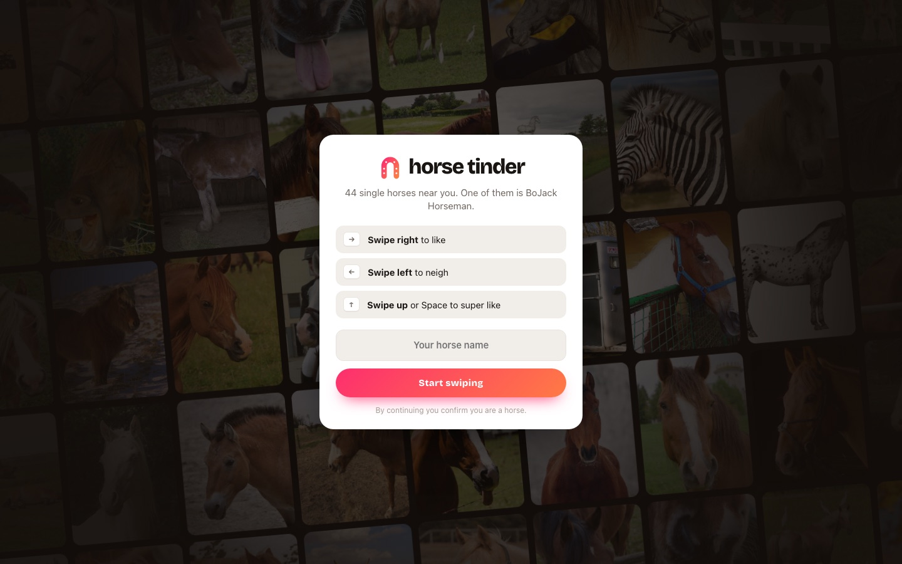

# 🐴 Horse Tinder

**Find your stablemate.** It's Tinder, but for horses.

### ▶ [Play it here: bouwles.github.io/horse-tinder](https://bouwles.github.io/horse-tinder/)

Made as a joke to test out Claude Opus 5.5.

Made with love by **Paul Nercessian** and **Neil Thakkar** ❤️



| It's a match | Chatting with BoJack |
|---|---|
|  |  |

| Mobile | Matches & messages | Welcome screen |
|---|---|---|
|  |  |  |

## What's in it

- **44 horses** with bios, traits, red flags and stats. They include Big Tony (a miniature horse), Concrete (a horse statue by a motorway), Gerald ("29", actual age 41), Ziggy (definitely not a zebra) and **BoJack Horseman**.
- **Rare profiles:** Mystery Horse (censored until you swipe), Verified Horse, Celebrity Horse (1.2M followers), Definitely A Horse (a man in a horse mask) and The Final Horse.
- **Matches** with an "IT'S A MATCH" screen, confetti, a synthesized whinny and a compatibility score. Categories include *Carrot compatibility* and *Emotional availability*.
- **Fake chats.** Every horse has its own personality. Some text back fast, some leave you on read, and Concrete never replies. Don't mention glue.
- Swipe history, a matches and messages inbox, rewind, boost, a "pay 1 carrot" upgrade, dark mode, sound effects, and uploading your own profile photo.
- Everything saves to your browser's localStorage.

## Controls

| Action | Mouse / touch | Keyboard |
|---|---|---|
| Like | Drag right, or ❤ | → |
| Neigh | Drag left, or ✕ | ← |
| Super like | Drag up, or ★ | Space |
| Full profile | ⌃ button | ↓ |
| Rewind | ↺ button | Z |
| Next photo | Click the left/right side of the photo | |

## Run it locally

No dependencies and no build step:

```
git clone https://github.com/Bouwles/horse-tinder.git
cd horse-tinder
npm start
```

`npm start` runs a tiny static server and opens the game in your browser. You can also just open `index.html`.

## Credits

- Horse photos come from [Wikimedia Commons](https://commons.wikimedia.org) under their free licenses. Authors and licenses for each photo are in [CREDITS.md](CREDITS.md). All names, bios and captions are fictional and aren't about the real animals.
- BoJack Horseman © Netflix / Tornante. This is a non-commercial fan parody.
- This is a parody and isn't affiliated with Tinder.
